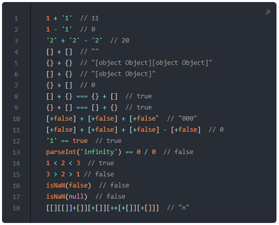

# JS 中让人疑惑的表达式以及背后的原理

比如请说出以下这些表达式的结果：

* `1 + '1'`
* `1 - '1'`
* `'2' + '2' - '2'`
* `[] + []`
* `{} + {}`
* `[] + {}`
* `{} + []`
* `[] + {} === {} + []`
* `{} + [] === [] + {}`
* `[+false] + [+false] + [+false]`
* `[+false] + [+false] + [+false] - [+false]`
* `'1' == true`
* `parseInt('infinity') == 0 / 0`
* `1 < 2 < 3`
* `3 > 2 > 1`
* `isNaN(false)`
* `isNaN(null)`
* `[[][[]]+[]][+[]][++[+[]][+[]]]`

<!-- ```js
  1 + '1'  // 11
  1 - '1'  // 0
  '2' + '2' - '2'  // 20
  [] + []  // ""
  {} + {}  // "[object Object][object Object]"
  [] + {}  // "[object Object]"
  {} + []  // 0
  [] + {} === {} + []  // true
  {} + [] === [] + {}  // true
  [+false] + [+false] + [+false`  // "000"
  [+false] + [+false] + [+false] - [+false]  // 0
  '1' == true  // true
  parseInt('infinity') == 0 / 0  // false
  1 < 2 < 3  // true
  3 > 2 > 1 // false
  isNaN(false)  // false
  isNaN(null)  // false
  [[][[]]+[]][+[]][++[+[]][+[]]]  // "n"
``` -->


如果想知道正确答案的话把表达式粘贴到浏览器的控制台执行即可

<template>
  <div>
    <button @click='ifImgShow = !ifImgShow'>懒人一步洞晓答案</button>
    <br/>
    
  </div>
</template>

接下来的内容就是讲解这些表达式的结果是在什么样的原理下得出的

解决以上的问题的关键在于要搞明白三点：

1.  操作符的使用方法和优先级
2.  操作数在操作符的上下文中数据类型转化规则
3.  语法中的特例

## `+` 操作符

`+`在 JavaScript 中有三个作用：

1.  连接字符串：`var result = 'Hello' + 'World'`
2.  计算数字之和：`var result = 1 + 2`
3.  作为一元操作符：`+variable`

在表达式中`+`是操作符（operator），操作符操作的对象（上面例子中的`Hello`、 `World`、 `1`、 `2`）名为操作数（operand）

一元`+`操作符的运算规则是：`ToNumber(ToPrimitive(operand))`，也就是把任意类型都转化为数字类型。

当操作数的数据类型不一致时，会根据以下规则进行转化：

* 如果至少一个操作数是对象数据类型（`object`），则需要将它转化为基础类型（`primitive`），即字符串、数字或者布尔

    1.  如果对象是`Date`类型，那么调用`toString()`方法
    2.  否则优先调用 `valueOf()` 方法
    3.  如果`valueof()`方法不存在或者并没有返回一个基础类型，那么调用`toString()`
    4.  当数组转化为基础类型时，JavaScript 会使用`join(',')`方法
    5.  单纯的 Javascript 对象 `{}` 转化的结果是 `[object Object]`

* 转化之后，如果至少一个操作数是字符串类型，那么另一个操作数也需要转化为字符串类型，然后执行连接操作
* 在其他的情况下，两个操作数都转化为数值类型，并且执行加法操作
* 如果两个操作数都是基础类型，操作符会判断至少一个是字符串类型并且执行连接操作。其他情况都转化为数字并且求和

所以根据以上规则，我们就能解释：

* `1 + '1'` 的结果是 `'11'`，因为其中一个是操作数是字符串，所以另一个操作数也被转化为字符串，并且执行字符串连接操作
* `[] + []` 的结果是 `''` 空字符串，因为数组是对象类型，转化为基础类型的结果是空字符串，拼接之后仍然是空字符串
* `[] + {}` 的结果是 `[object Object]`，因为操作数有对象类型的关系，两个操作数都需要转化为基础类型，`[]`转化为基础类型的结果是`''`，`{}`转化为基础类型的结果是`[object Object]`，最后字符串拼接的结果仍然是`[object Object]`

接下来我们说一说值得注意的情况

* `{} + []` 的结果是`0`。因为在这个表达式中，开头`{}`并不是空对象的字面量，而是被当作空的代码块。事实上这个表达式的值就是`+[]`的结果，即`Number([].join(','))`，即为`0`

* 更奇怪的是`{} + {}`这个表达式，在不同的浏览器中执行会得到不同的结果。
    按照上面的例子，我们可以同理推出这个表达式的值实际上是`+{}`的值，即最后的结果是`Number([object Object])`，即`NaN`。在 IE 11 中的执行结果却是是如此，但是如果在 Chrome 中执行，你得到的结果是 `[object Object][object Object]`。

根据 [Stackoverflow上的回答](https://link.juejin.im/?target=https%3A%2F%2Fstackoverflow.com%2Fquestions%2F36438034%2Fwhy-is-no-longer-nan-in-chrome-console) 这是因为 Chrome devtools 在执行代码的时候隐式的给表达式添加了括号`()`，实际上执行的代码是`({} + {})`。如果你在 IE 11 中执行`({} + {})`，就会得到`[object Object][object Object]`的结果

* 虽然上面我们已经明确了 `[] + {}` 的结果是 `[object Object]`，而 `{} + []` 的结果是`0`，但是如果把他们进行比较的话：`[] + {} === {} + []`结果会是`true`。因为右侧的`{}`跟随在`===`之后的关系，不再被认为是空的代码块，而是字面量的空对象，所以两侧的结果都是`[object Object]`

* `{} + [] === [] + {}` 同样是一个有歧义的结果，理论上来说表达式的返回值是`false`，在 IE 11 中确实如此，但是在 Chrome 的 devtools 中返回 `true`，原因仍然是表达式被放在`()`中执行

* `[+false] + [+false] + [+false]`的结果也可想而知了，`+false`的结果是`false`转化为数字`0`，之后`[0]`又被转化为基础类型字符串`'0'`，所以表达式最后的结果是`'000'`

## `-`操作符

虽然`-`操作符和`+`操作符看看上去性质相同，但`-`操作符只有一个功能，就是数值上的相减。它会尝试把非数值类型的操作数转化为数值类型，如果转化的结果是`NaN`, 那么表达式的结果可想而知也就是`NaN`，如果全部都转化成功，则执行减法操作，所以

* `1 - '1'` 实际上执行的是 `1 - 1`，结果为 `0`
* `'2' + '2' - '2'` 表达式首先要遵循从左至右的执行顺序，`'2' + '2'`的执行的是字符串拼接，结果是`'22'`，在接下来的`'22' - '2'`计算中两个操作数都成功的转化为了数字，结果是数字相减的结果`20`
* `[+false] + [+false] + [+false] - [+false]`表达式实际上执行的是`'000' - '0'`，最后的结果也就是数字`0`

## `==`操作符

在 JavaScript 中`===`称为恒等操作符（The identity operator），`==`称为相等操作符（The equality operator）。因为篇幅关系在这里我们简单的针对题目聊聊后者

如果`==`操作符的操作数的数据类型不同：

1.  如果一个操作数是`null`，并且另外一个操作数是`undefined`，他们是相等的
2.  如果一个操作数是数值类型，并且另一个是字符串类型，那么把字符串类型转化为数值类型再进行比较
3.  如果一个操作数是布尔类型，那么把`true`转化为1，`false`转化为0在进行比较
4.  如果一个操作数是对象，另一个操作数是数字或者字符串，那么把对象转化为基本类型再进行比较

* 根据以上规则，在计算表达式`'1' == true`时，首先将`true`转化为数字`1`，此时表达式中同时存在数值和字符串类型，再把字符串`'1'`转化为数字`1`，最终`1 == 1`当然成立
* 表达式`parseInt('infinity') == 0 / 0`实际上是在判断`NaN == NaN`，这样的比较是一个特例，无论是在`==`比较还是`===`比较中，`NaN`不会与任何东西相等；或者说只要有任意操作数是`NaN`，那么表达式就会返回`false`

更全面`==`和`===`的比较规则请参考: [The legend of JavaScript equality operator](https://link.juejin.im/?target=https%3A%2F%2Fdmitripavlutin.com%2Fthe-legend-of-javascript-equality-operator%2F)

比较运算符`>`和`<`也遵循相似的规则: 1. 优先将字符串转化为数字进行比较；2. 将布尔类型转化为数字再进行比较，

* 在表达式`1 < 2 < 3` 中，首先执行`1 < 2`，结果为`true`，但是在比较`true < 3`的过程中，需要把`true`转化为数值类型`1`，最终比较`1 < 3`，返回值为 `true`
* 同理在表达式`3 > 2 > 1`中，最终比较的其实是`true > 1`，也即是`1 > 1`当然返回的是`false`

## `isNaN`

"NaN"是"Not a Number"的缩写，我们以为`isNaN`能够直接用来判断值是否是数字类型，但实际上并不可以。因为`isNaN`首先会强制将参数转化为数值类型，再进行判断。
这也就不难解释为什么`isNaN(false)`和`isNaN(null)`返回都是`true`，因为`false`和`null`都能被成功转化为数字`0`, 所以对于`isNaN`来说，它们是数字

## 结束

最后我们以表达式`[[][[]]+[]][+[]][++[+[]][+[]]]`作为文章的结尾

在这个表达式中出现了三种操作符，分别是

* 成员操作符: `[]`
* 一元操作符: `+`
* 作为求和或者连接字符串作用的操作符: `+`
* 自增操作符: `++`

根据操作符的[优先次序表](https://link.juejin.im/?target=https%3A%2F%2Fdeveloper.mozilla.org%2Fen-US%2Fdocs%2FWeb%2FJavaScript%2FReference%2FOperators%2FOperator_Precedence)，我们能确定操作符的优先级依次是: `[]` > 一元操作符`+` > `++` > `+`

所以根据优先级我们首先可以计算出表达式的`+[]`部分，并且将表达式的这一部分用计算结果替换掉: `[[][[]]+[]][0][++[0][0]]`

接下来我们把表达式拆分为三部分看待: `[ [][[]]+[] ] [0] [ ++[0][0] ]`。如果还是不清晰的话，三部分从左到右分别是：

1.  `[ [][[]]+[] ]`
2.  `[0]`
3.  `[ ++[0][0] ]`

我们先看第一部分中`+`前面的 `[][[]]` 操作数，第一个`[]`是空数组，而紧跟着的`[[]]`是属性访问器（成员操作符），属性访问器内的`[]`会被强制转化为字符串类型，最终的结果即是空字符串`''`，所以第一个操作数的最终结果其实是`[]['']`，即是`undefined`，而又因为`+`操作符的规则，最终`[][[]]+[]`表达式的结果是字符串`'undefined'`，那么现阶段表达式的结果是`['undefined'][0][++[0][0]]`，即`'undefined'[++[0][0]]`

接下来我们解决第三部分: `[++[0][0]]`，我已经知道成员操作符`[]`的优先级要高于自增操作符`++`, 所以关于表达式`++[0][0]`，我们需要首先计算`[0][0]`，结果是`0`，之后计算`++0`的结果即是`1`

所以最终表达式转化为了`'undefined'[1]`，最终的结果即是`'n'`

本文也同时发布在我的知乎专栏[前端技术漫游指南](https://link.juejin.im/?target=https%3A%2F%2Fzhuanlan.zhihu.com%2Ffront-end)上，欢迎大家关注

### 参考文章

* [JavaScript addition operator in details](https://link.juejin.im/?target=https%3A%2F%2Fdmitripavlutin.com%2Fjavascriptss-addition-operator-demystified%2F)
* [The legend of JavaScript equality operator](https://link.juejin.im/?target=https%3A%2F%2Fdmitripavlutin.com%2Fthe-legend-of-javascript-equality-operator%2F)
* [What is the explanation for these bizarre JavaScript behaviours mentioned in the 'Wat' talk for CodeMash 2012?](https://link.juejin.im/?target=https%3A%2F%2Fstackoverflow.com%2Fquestions%2F9032856%2Fwhat-is-the-explanation-for-these-bizarre-javascript-behaviours-mentioned-in-the)
* [Why is {} + {} no longer NaN in Chrome console?](https://link.juejin.im/?target=https%3A%2F%2Fstackoverflow.com%2Fquestions%2F36438034%2Fwhy-is-no-longer-nan-in-chrome-console)
* [Why does JavaScript handle the plus and minus operators between strings and numbers differently?](https://link.juejin.im/?target=https%3A%2F%2Fstackoverflow.com%2Fquestions%2F24383788%2Fwhy-does-javascript-handle-the-plus-and-minus-operators-between-strings-and-numb)
* [Operator precedence](https://link.juejin.im/?target=https%3A%2F%2Fdeveloper.mozilla.org%2Fen-US%2Fdocs%2FWeb%2FJavaScript%2FReference%2FOperators%2FOperator_Precedence)
* [Member operators](https://link.juejin.im/?target=http%3A%2F%2Flearnjavascript.co.uk%2Freference%2Foperators%2Fmember.html)
* [isNaN()](https://link.juejin.im/?target=https%3A%2F%2Fdeveloper.mozilla.org%2Fzh-CN%2Fdocs%2FWeb%2FJavaScript%2FReference%2FGlobal_Objects%2FisNaN)


<script>
  export default {
    data(){
      return {
        ifImgShow: false
      }
    }
  }
</script>
